# Cwntflow: Git Development Workflow

> Inspired by the Trunk Based Development Model

<!-- toc -->

- [Development Workflow](#development-workflow)
  - [`core-team-flow`](#core-team-flow)
    - [`async-review`](#async-review)
  - [`contributors-flow`](#contributors-flow)
    - [`pr-workflow`](#pr-workflow)
- [Release cycle](#release-cycle)
- [Definitions](#definitions)
  - [`cwntflow`](#cwntflow)
  - [Roles](#roles)
    - [`core-team`](#core-team)
    - [`contributors`](#contributors)
  - [Branches](#branches)
    - [`mainline`](#mainline)
  - [Repos](#repos)
    - [`central-repo`](#central-repo)
    - [`fork`](#fork)
  - [Remotes and `local`](#remotes-and-local)
- [`cwntflow` Principles](#cwntflow-principles)
  - [Async review / non-blocking review.](#async-review---non-blocking-review)
  - [CI](#ci)
  - [General](#general)
- [Pending Topics](#pending-topics)
  - [Testing automation](#testing-automation)
  - [Feature toggles](#feature-toggles)
- [References](#references)

<!-- tocstop -->

## Development Workflow

### `core-team-flow`


- `continuous-push-process`
  - At least daily pushes
  - `local`: Tests and checks:
    - pre-commit hooks
    - pre-push hooks
      - tests (unit, integration, etc)

#### `async-review`

- Only for the `core-team`
- Before starting new work.
- First thing of the day.
- All issues will be reviewed (Ripissue).
  - Each issue groups "all" commits
  - "All" commits will be reviewed

### `contributors-flow`


#### `pr-workflow`

Followed by a `contributor` to work on the project (at his own `fork`).


## Release cycle

`admin` is responsible for the release cycle.

Depending on the release tag, it can be deployed at different environments.

```mermaid
sequenceDiagram
participant M as `mainline`
participant C as 🤖🚀 CD
participant S as 🧪🖥️ Staging
participant P as 🌐🖥️ Production
loop staging-cycle
  M ->> C: vX.X.X-rcY
  C ->> C: tests/checks
  C ->> S: deploy
  S ->> M: feedback
end
M ->> C: vX.X.X
C ->> C: tests/checks
C ->> P: deploy
```



- `🤖🚀 CD`: Will trigger a CD automation to deploy (or make a release bundle)
  - build + tests + deploy
- `vX.X.X-rcY`: pre-release tag as a release candidate (or alpha, beta, etc)
- `vX.X.X`: release tag version to production
- `🧪🖥️ Staging`:
  - stakeholders
  - QA
  - Product owners

## Definitions

### `cwntflow`

- trunk based development
- "Automated tests, code converge, and code reviews provides a trunk-based development project with the assurances it’s ready to deploy to production at any time." [^8]
- Develop in small batches
- Feature flags / feature toggles
- Implement comprehensive automated testing
- Perform asynchronous code reviews
- "Once a branch merges, it is best practice to delete it." [^8]
- Commits to `mainline` at least once a day.
- Reduced number of code freezes and integration phases
- Build fast and execute immediately
  - "build and test execution times should be optimized"

- Great releases[^9]
  - Great software releases start with modular architecture
  - Great software releases are powered by great relationships
  - Great software releases are simple to push
    - Automate! Automate! Automate!

### Roles

#### `core-team`

- `central-repo` maintainers
- Can commit/push/pull directly to the `mainline`
- A `core-team` member can be:
  - `dev`: developer
  - `admin`: `central-repo` administrator
    - Setup and config automation (DevOps, CD, etc)
    - Mark releases (tags the `mainline`)

#### `contributors`

- External contributors for the project (external)
- Can read and fork the whole `central-repo` as well as it's `mainline`
- Can not commit/push directly to `central-repo`
- Can contribute to the project by following the `pr-workflow` pairing with a `core-team` member

### Branches

#### `mainline`

- The main/essential branch (e.g. `master`) at the `central-repo` is called: `mainline`

### Repos

Overview:

```
                    +----------------------+
                    |   Central Repository |
                    |     `central-repo`   |
                    |       (admin)        |
                    +----------------------+
                               |
                 +-------------+-------------+
                 |                           |
         +-------v-------+           +-------v-------+
         |     local     |           |   Remotes     |
         | `admin`'s PC  |           |               |
         +---------------+           +---------------+__
                                         |    |  |      \
                +------------------------+    |  |       \
                |                             |  \        \
         +------v------+                      |   \        \
         |   `origin`  |                      |    \        -------
         |   (admin)   |                      |     \              \
         +-------------+                      |      \_             \
                                              |        \              \
                                              |         \              \
                                              |          \              \
                                     +--------v------+  +-v-----------+  +v-----------+
                                     | `dev-gubasso` |  | `dev-ismael`|  | `dev-linda`|
                                     |   (gubasso)   |  |   (ismael)  |  |   (linda)  |
                                     +---------------+  +-------------+  +-------------+

Developers Forks:

     +----------------------------+
     |  Developer Fork `dev-<id>` |
     +----------------------------+
               |
         +-----v--------------+
         |      `local`       |
         |     gubasso's PC   |
         +--------------------+
               |
     +---------+-------------+-----------------------+
     |                       |                       |
+----v---------------+   +---v---------------+   +---v------------------+
|  `origin`          |   |     `upstream`    |   |     `contrib-john`   |
|  gubasso's remote  |   |    (`mainline`)   |   |     john's remote    |
+--------------------+   +-------------------+   +----------------------+

Contributers Forks:

     +----------------------------------+
     |  Contributer Fork `contrib-<id>` |
     +----------------------------------+
               |
         +-----v--------------+
         |      `local`       |
         |     john's PC      |
         +--------------------+
               |
     +---------+-----------------+
     |                           |
+----v---------------+       +---v-------------------+
|  `origin`          |       |     `dev-gubasso`     |
|  john's remote     |       |  (gubasso's remote)   |
+--------------------+       +-----------------------+
```


#### `central-repo`

- Central repository `central-repo` (`admin` is responsible)
- Has one main/essential branch: `master` branch (which is called `mainline`)

- `core-team` commits/pushes/pulls directly do `master`, continuously, daily, multiple times a day.
- It's the development branch

- `local`: `admin`'s computer
- remote repo at a git server (github, gitolite, etc.)
  - `origin`: central repository remote name for the `admin`
  - `upstream`: central repository name for `devs`

- Developers fork `dev-<id>`
  - `local`: `dev`'s computer
  - remote repo at a git server (github, gitolite, etc.)
    - `origin`: fork repository remote name for the `dev`
    - `dev-<id>`: fork repository remote name for the `admin`


#### `fork`

- Can be a `core-team` or `contributors` fork of the `central-repo`

### Remotes and `local`

- Everybody must have a:
  - `local` copy (at the individual's computer)
  - have it's own `local` and `origin`

- Remotes organized and named differently by the individual role.
- Remotes names are:
  - `origin`
  - `upstream`
  - `dev-<core-team_user_name>`
  - `contrib-<contributors_user_name>`

Remote naming explanation:

- `origin`: cloud based remote copy/mirror of the `local`
  - owned by the respective role
  - the `admin`'s `origin` will be the cloud-based `central-repo`
  - `dev`'s and `contributor`'s `origin` are `fork`s of the `central-repo`.

- `upstream`: remote pointing to the `central-repo`
  - `dev`s and `contributors` should follow this naming convention to refer to the `central-repo`
  - `admin` will not have a `upstream` remote. His `origin` refers to the `central-repo` itself.

- `dev-<core-team_user_name>`: remotes of `dev`s from the `admin` or `contributors` perspective. Can be multiple developers repositories.

- `contrib-<contributors_user_name>`: remotes of a `contributor` from a `dev` perspective. Can be multiple contributors repositories.

## `cwntflow` Principles

### Async review  / non-blocking review.

Principles of async reviews. [^1] [^2]

- "Bug findings are not the goal of a code review. Code review's are about code quality."
- "Reviews aren't definitive for release"
- "To avoid context-switching, we also decided that whenever someone finished a piece of work, before starting new work or at the start of the day, they would first check the To Review column to spot whether nothing is waiting to be code reviewed."
  - Dedicate half an hour at the start of the day where the whole team reviews the commits of the last day.
- Have an optional half-hour call every day to discuss code with the team.
- every commit will be reviewed
  - group all commits based on a ticket number to create a code review

### CI

- Implications of CI:[^5]
  - "We can't wait to commit only on 'feature complete'".
  - "We need to become comfortable committing partially complete features".
  - "For CD, we need to become comfortable DEPLOYING partially complete features."

- "The fundamental assumption of CI is that there is only one interesting version, the current one."[^7]

### General

- How to deploy incomplete features?[^5]
  - Strategies can work together
  - Strategies (from less to more complex implementations)
    - Dark launch
    - Branch by abstraction
      - Code has modular abstractions
      - Improve abstraction step-by-step
      - Clean interfaces
      - Substitute components with new ones (connect to an already usable interface)
      - Prepare to connect a module when its ready
    - Feature flags / Feature toggles

- MS VSTS short branch model (`vsts-branch-model`). [^6]
  - Is a `trunk-based-development`
  - MS VSTS creates a short branch, from the `mainline`, to small implementations.
  - this branch is fetched to the `dev`'s `local` to work
  - when ready, this brach is merged to `mainline` and deleted

- `cwntflow`: Simulates `vsts-branch-model` with a `fork` for each `dev`
  - each `fork` is a "short branch"
  - it will keep going, but is always merged
  - the features are closed constantly (e.g. ripissue issues)

- Only allowed to commit to the `mainline`.[^4]
  - If it has a release branch, it will cherrypick the bug fixes from the `mainline`

- Check quality as fast as possible (automation/tests, reviews, etc).[^4]
  - Push quality upstream (shift left).
  - Safe deployment techniques (minimizing impact).

- Kanban status
  - in progress
  - to review
  - to test
  - done

- Versioning (with pre-releases) [^3]
  - 1.0.0-alpha < 1.0.0-alpha.1 < 1.0.0-alpha.beta < 1.0.0-beta < 1.0.0-beta.2 < 1.0.0-beta.11 < 1.0.0-rc.1 < 1.0.0
- Excellent code coverage
- TDD
- Strong automation
- Automatic workflows (testing, deploy, etc)
  - E.g. deploy to env depending on tag
    - if pre-release (`-alpha`, `-beta`, `-rc`) -> staging
    - if not pre-release -> production
- Release strategies for libraries/binaries (e.g. Ripissue)
  - pre-release: github release (binary available via wget)
  - release: crates.io (cargo `install` or `binstall`)
- Use feature toggles
- If a branch is created at the `central-repo`, this branch has to short live.
- Each `dev` fork is like a feature branch.
  - But it has to be merged daily to the `central-repo`

- What will trigger the tests?
  - `local` (all tests)
    - Pre-push hook
  - `mainline` (hybrid approach)
    - fast tests after each push
    - slow/costly tests periodically (e.g. daily)


## Pending Topics

Pending topics to study and implement.

### Testing automation

- testing article to read: https://www.atlassian.com/continuous-delivery/software-testing/types-of-software-testing

### Feature toggles

> feature flags

- manage?
  - https://www.npmjs.com/package/simple-file-toggle
- [What are Feature Flags? - IBM Technology](https://www.youtube.com/watch?v=AJa2B-twtG4)
- [Feature Flags (É gambiarra?) // Dicionário do Programador - Código Fonte TV](https://www.youtube.com/watch?v=dml7nKi9WI0)
- https://martinfowler.com/articles/feature-toggles.html
- https://crates.io/search?page=2&q=feature%20toggle
- https://www.atlassian.com/solutions/devops/integrations/feature-flags


## References

- [I’ve Found Something BETTER Than Pull Requests... - Continuous Delivery](https://www.youtube.com/watch?v=WmVe1QrWxYU)
t [What is the "best way" to develop software applications? - Web Dev Cody](https://www.youtube.com/watch?v=oNmcX6Gozg0)
  - Trunk Based Development
- [Optimizing the Software development process for continuous integration and flow of work](https://itnext.io/optimizing-the-software-development-process-for-continuous-integration-and-flow-of-work-56cf614b3f59)
  - Trunk Based Development
  - Feature toggles
- [How feature branches and pull requests work against best practice](https://itnext.io/how-feature-branches-and-pull-requests-work-against-best-practice-a13a85a016ef)
- [Branching Strategies Explained - DevOps Toolkit](https://www.youtube.com/watch?v=U_IFGpJDbeU)
  - Feature toggles
  - Trunk-Based development
  - Feature branches or GitHub Flow
  - Forking strategy
  - Release branches
  - Git Flow
  - Environment branches
  - Which strategy should you use?
- [Pare de sofrer com merges AGORA mesmo use Trunk Based Development - Pisani da ArcH](https://www.youtube.com/watch?v=j6gW_F_YbH0)
- [Real Programmers Commit To Master - Jakob Ehn - Swetugg](https://www.youtube.com/watch?v=hL1OZfgoZGk)
- [Continuous Integration vs Feature Branch Workflow - Continuous Delivery](https://www.youtube.com/watch?v=v4Ijkq6Myfc)
- [Git patterns and anti-patterns for successful developers : Build 2018 - Microsoft Developer](https://www.youtube.com/watch?v=ykZbBD-CmP8)
- [WHY TRUNK BASED DEVELOPMENT IS IMPORTANT | CONTINUOUS INTEGRATION EXPLAIN | MERGE HELL InterviewDOT - Interview DOT](https://www.youtube.com/watch?v=1h2rpoi5YeE)
- [Git Flow Is A Bad Idea - Continuous Delivery](https://www.youtube.com/watch?v=_w6TwnLCFwA)
- [Trunk-based development](https://www.atlassian.com/continuous-delivery/continuous-integration/trunk-based-development)


<!-- ## footnotes -->

[^1]: https://thinkinglabs.io/articles/2023/05/02/non-blocking-continuous-code-reviews-a-case-study.html "NON-BLOCKING, CONTINUOUS CODE REVIEWS - A CASE STUDY"
[^2]: https://www.youtube.com/watch?v=WmVe1QrWxYU "I’ve Found Something BETTER Than Pull Requests... - Continuous Delivery"
[^3]: https://semver.org/ "Semantic Versioning 2.0.0"
[^4]: https://www.youtube.com/watch?v=hL1OZfgoZGk "Real Programmers Commit To Master - Jakob Ehn - Swetugg"
[^5]: https://www.youtube.com/watch?v=v4Ijkq6Myfc "Continuous Integration vs Feature Branch Workflow - Continuous Delivery"
[^6]: https://www.youtube.com/watch?v=ykZbBD-CmP8 "Git patterns and anti-patterns for successful developers : Build 2018 - Microsoft Developer"
[^7]: https://www.youtube.com/watch?v=_w6TwnLCFwA "Git Flow Is A Bad Idea - Continuous Delivery"
[^8]: https://www.atlassian.com/continuous-delivery/continuous-integration/trunk-based-development "Trunk-based development"
[^9]: https://www.atlassian.com/agile/software-development/release "Three ingredients for great software releases"
