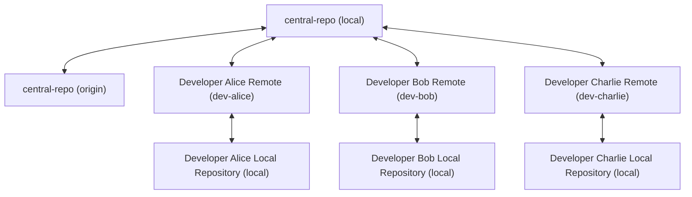
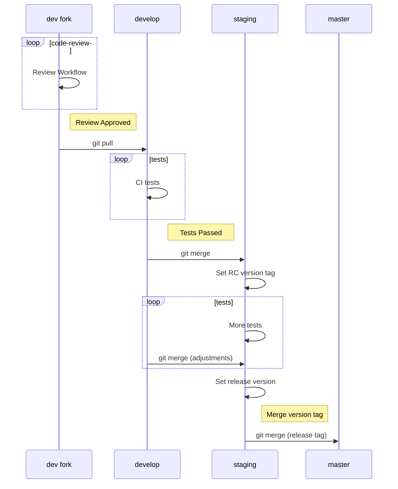

# Cwntflow: Git Development Workflow

<!-- toc -->

- [Principles](#principles)
- [Roles](#roles)
- [Central repository](#central-repository)
  - [`central-repo`: Setting up it's remotes](#central-repo-setting-up-its-remotes)
  - [`central-repo`: Development Branches](#central-repo-development-branches)
- [Release workflow](#release-workflow)
- [Pull-Requests (PR's)](#pull-requests-prs)
- [Peer code review workflow](#peer-code-review-workflow)
- [Development forks](#development-forks)
  - [Setting up the remotes](#setting-up-the-remotes)
  - [Basic workflow](#basic-workflow)
- [[[git-commands#Get latest code state of a project]]](#git-commands%23get-latest-code-state-of-a-project)
  - [Git Feature Branch Workflow](#git-feature-branch-workflow)
- [Unorganized](#unorganized)

<!-- tocstop -->

## Principles

- The project will have a [[#Central repository]][^git1]
  - This will be the main source code of this project
  - The development stages will be separated by branches in this repo[^git2]
- Each developer will have his own [[#Development forks]] of the central repository
  - Where each dev will work in it's own implementation

## Roles

- Basic roles:
  - `admin`: responsible to manage and maintain the main/central project repository ([[#Central repository]]).
  - `developer` / `dev`: coders, developers, project builders, contributors.
  - `reviewer` / `rev`: code reviewer before a pull-request.

- The same person may accumulated multiple roles.

## Central repository

- Official/main project history
- Role responsible for this repo: `admin`
- Central Repository Id: `central-repo`
  - Id of the repo at the `admin` personal computer: `local`
  - Id of the remote mirror/backup at a server: `origin`

### `central-repo`: Setting up it's remotes

- The `admin` will be responsible for the central repository structure, which will be composed by:
  - Local repository at his personal computer (`local`)
  - A remote repository that will mirror/backup his `local` repo (`origin`)
  - A **REMOTE** repository for each developer that is contributing to the project (`dev-<id>`)

- Example:



- `local`: The repository at the owner's computer (`admin`, dev's...)
- `dev-alice`: Remote repository for Alice (from the `admin`'s perspective).
- `dev-bob`: Remote repository for Bob (from the `admin`'s perspective).
- `dev-charlie`: Remote repository for Charlie (from the `admin`'s perspective).

### `central-repo`: Development Branches

There will be 3 main branches:

- `master`: working, tested, reliable, production ready code.
  - Where the project will release new available stable versions.
  - E.g.: `v0.5.0`, `v1.2.0`, etc.
- `staging`: code in the last stage of tests.
  - Where the project will set release candidates (rc's).
  - E.g.: `v0.5.0-rc1`, `v0.5.0-rc2`, `v1.2.0-rc1`, etc.
- `develop`: latest code implementations from developers.
  - Code will be merged from developers forks by the `admin` only if it passes the following conditions:
    - Passes the CI/CD checks and tests
    - [[#Peer code review workflow]] completed and approved by the `reviewer`
  - The `develop` branch may have sub-branches, organized and managed by the `admin`. Their purposes may be:
    - Follow a specific `dev` fork and/or branch.
    - Reserved for a specific feature/implementation.

## Release workflow

- Responsible: `admin`
- At: `central-repo`



## Pull-Requests (PR's)

- `dev` code to be PR'ed needs to be at his `origin` remote repo
- `dev` communicates the `admin` the PR
  - e-mail, chat message, etc...
- PR's should be daily: from `dev`'s to `central-repo`'s `develop` branch
  - The `admin` may choose to merge certain `dev`'s code to another `develop`'s sub-branch (instead of the `develop` branch itself)

## Peer code review workflow

## Development forks

- Where each dev will work on the project
- Each dev will have the freedom to work as he pleases inside it's own fork
- However, we recommend using some workflow conventions to make it easier to integrate with the **Cwntflow**.

- Once a branch merges, it is best practice to delete it. A repository with a large amount of active branches has some unfortunate side effects.[^git3]

### Setting up the remotes

- The developer will have his own fork structure, which will be composed by:
  - Local repository at his personal computer (`local`)
  - A remote repository that will mirror/backup his `local` repo (`origin`)
  - A remote repository pointed to the [[#Central repository]] (`upstream`)


### Basic workflow

- [[git-commands#Get latest code state of a project]]
  -


---
---
---


### Git Feature Branch Workflow

Project branches:

- master: code in production
- staging: code to be tested
- develop: code in development
    - branches from develop: issues/features/elements to be implemented

#### A) Implementation: `user-dev`

1) Update develop branch

```sh
git checkout develop
git fetch origin
git reset --hard origin/develop
```

2) Create a new branch with the name of the issue/feature/element

```sh
git checkout -b new-feature
```

3) Update, add, commit, and push changes
4) Push feature branch to remote

#### B) Review: Open Pull Request (PR)

1) `user-dev` opens a PR
    - can be just a tag inside the issue `new-feature`
2) `user-reviewr` pulls `new-feature` and starts reviewing the PR's `new-feature` branch

```sh
git pull origin new-feature
git checkout new-feature
```

3) `user-reviewr` reviews `user-dev`'s code
4) `user-dev` can make any adjustments in his local repository and push changes to remote
5) `user-reviewr` pulls new `user-dev` changes and review cicle continues
6) `user-dev` pushes final branch version
7) `user reviewr` pull/pushes final reviewd code, sealing this branch

#### C) Close PR: Merge/Publish feature

1) Merge `develop` to `new-feature` branch

a) ensure that HEAD is pointing to the correct merge-receiving branch
b) Make sure the receiving branch and the merging branch are up-to-date
```sh
git checkout receiving-branch
git fetch
git reset --hard origin/develop
git merge develop
```

2) `user-authority` merges `new-feature` branch to `develop`

2.1) Possible merge strategies:

a) simple merge commit

```sh
git checkout develop
git merge new-feature
```

b) squashes your `new-feature` branch down to one commit

```sh
git checkout develop
git merge --squash new-feature
# https://randyfay.com/comment/1093#comment-1093
```
or
```sh
git merge --no-commit --no-ff $BRANCH
# to examine the staged changes:
git diff --cached
# And you can undo the merge, even if it is a fast-forward merge:
git merge --abort
# [Is there a git-merge --dry-run option?](https://stackoverflow.com/questions/501407/is-there-a-git-merge-dry-run-option)
```

3) delete that brach from local and remote (if needed)

```sh
git branch -d branch-name
# to delete remote branch too
git push origin -d branch-name
```

Or, to cleanup branches from project, see[^clear-branches].

#### References

- [Git Feature Branch Workflow](https://www.atlassian.com/git/tutorials/comparing-workflows/feature-branch-workflow)
- [What is the difference between git pull and git reset --hard origin/<branch>?](https://stackoverflow.com/questions/43037293/what-is-the-difference-between-git-pull-and-git-reset-hard-origin-branch)
- [Git merge conflicts](https://www.atlassian.com/git/tutorials/using-branches/merge-conflicts)
[^clear-branches] [How to Delete Already Merged Git Branches (local and remote)](https://www.w3docs.com/snippets/git/how-to-delete-already-merged-git-branches.html)
    - https://github.com/hartwork/git-delete-merged-branches


<!-- ## footnotes/references -->

[^git1]: https://www.atlassian.com/git/tutorials/comparing-workflows#centralized-workflow "Comparing Git workflows: What you should know > Centralized workflow"
[^git2]: https://www.atlassian.com/git/tutorials/comparing-workflows/feature-branch-workflow "Git feature branch workflow"
[^git3]: https://www.atlassian.com/continuous-delivery/continuous-integration/trunk-based-development "Trunk-based development"

## Unorganized

- [Git Team Workflows Best Practices: Merge or Rebase?](https://www.atlassian.com/git/articles/git-team-workflows-merge-or-rebase)
- Learn to use email with git! https://git-send-email.io/ (git email workflow)
* <https://git-scm.com/book/en/v2/Distributed-Git-Distributed-Workflows>
* <https://mirrors.edge.kernel.org/pub/software/scm/git/docs/gitworkflows.html>
* <https://martinfowler.com/articles/branching-patterns.html>
