# Cwntflow: Git Development Workflow

> Inspired by [[#Trunk Based Development]]

<!-- toc -->

- [General info](#general-info)
- [Basic workflow](#basic-workflow)
  - [Daily Merge Process [daily-merge-process]](#daily-merge-process-daily-merge-process)
- [Release cycle](#release-cycle)
- [Feature flags](#feature-flags)
- [References](#references)
- [References](#references-1)
  - [Trunk Based Development](#trunk-based-development)

<!-- tocstop -->

- [ ] [Branching Strategies Explained - DevOps Toolkit](https://www.youtube.com/watch?v=U_IFGpJDbeU)
- [ ] [Pare de sofrer com merges AGORA mesmo use Trunk Based Development - Pisani da ArcH](https://www.youtube.com/watch?v=j6gW_F_YbH0)
- [ ] [What is the "best way" to develop software applications? - Web Dev Cody](https://www.youtube.com/watch?v=oNmcX6Gozg0)

- cwnt workflow
  - https://www.atlassian.com/continuous-delivery/continuous-integration/trunk-based-development
  - trunk based development
    - feature flag
    - https://crates.io/search?page=2&q=feature%20toggle

- testing article: https://www.atlassian.com/continuous-delivery/software-testing/types-of-software-testing
- release: https://www.atlassian.com/agile/software-development/release

## General info

- Central repository `central-repo` (`admin` is responsible)
  - `local`: `admin`'s computer
  - remote repo at a git server (github, gitolite, etc.)
    - `origin`: central repository remote name for the `admin`
    - `upstream`: central repository name for `devs`
- Developers fork `dev-<id>`
  - `local`: `dev`'s computer
  - remote repo at a git server (github, gitolite, etc.)
    - `origin`: fork repository remote name for the `dev`
    - `dev-<id>`: fork repository remote name for the `admin`

```
                    +----------------------+
                    |   Central Repository |
                    |     `central-repo`   |
                    |       (admin)        |
                    +----------------------+
                               |
                 +-------------+-------------+
                 |                           |
         +-------v-------+           +-------v-------+
         |     local     |           |   Remote Repo |
         | `admin`'s PC  |           |    (GitHub)   |
         +---------------+           +---------------+
                                         |       |       |        |
                +------------------------+       |       |        |
                |                                |       |        |
         +------v------+                         |       |        |
         |   `origin`  |                         |       |        |
         |   (admin)   |                         |       |        |
         +-------------+                         |       |        |
                                                /        \        \
                                               /          \        \
                                              /            \        \
                                     +------v------+  +------v------+  +------v------+
                                     | `dev-gubasso` |  | `dev-ismael`|  | `dev-linda`|
                                     |   (gubasso)   |  |   (ismael)  |  |   (linda)  |
                                     +---------------+  +-------------+  +-------------+

Developers Forks:

     +----------------------------+
     |  Developer Fork `dev-<id>` |
     +----------------------------+
               |
         +-----v-----------+
         |   local         |
         |   `<id>`'s PC   |
         +-----------------+
               |
     +---------+---------+
     |                   |
+----v-------+       +-----v-----+
|  `origin`  |       | `upstream`|
|   (`<id>`) |       |  (admin)  |
+------------+       +-----------+
```

## Basic workflow


### Daily Merge Process [daily-merge-process]

- Running tests
  - unit
  - integration
- pre-commit checks

## Release cycle

```mermaid
flowchart LR
M[🛠️ Master] --> T["🏷️ Tag"]
T -->|🤖🚀 CD| P[🖥️ Deploy]
```



- `🤖🚀 CD`: Will trigger a CD automation to deploy (or make a release bundle)
  - build + tests + deploy

Depending on the release tag, it can be deployed at different environments.

```mermaid
sequenceDiagram
participant M as 🛠️ Master
participant S as 🧪🖥️ Staging
participant P as 🌐🖥️ Production
loop staging-cycle
  M ->> S: vX.X.X-rcY
  S ->> M: tests feedback
end
M ->> P: vX.X.X
```



- `vX.X.X-rcY`: release tag as a release candidate
- `vX.X.X`: release tag version to production
- `🧪🖥️ Staging`:
  - stakeholders
  - QA
  - Product owners

## Feature flags

> feature toggle


## References

- [What is the "best way" to develop software applications? - Web Dev Cody](https://www.youtube.com/watch?v=oNmcX6Gozg0)

## References

### Trunk Based Development
