# Cwntflow: Git Development Workflow

> Inspired by [[#Trunk Based Development]]

<!-- toc -->

- [Definitions](#definitions)
  - [Roles: `core-team`](#roles-core-team)
  - [Roles: `contributors`](#roles-contributors)
  - [Branch: `mainline`](#branch-mainline)
  - [Repos: `central-repo`](#repos-central-repo)
  - [Remotes and `local`](#remotes-and-local)
  - [Repos: `fork`](#repos-fork)
  - [Process: `pr-workflow`](#process-pr-workflow)
  - [Process: `async-review`](#process-async-review)
- [General Principles](#general-principles)
- [Basic workflow](#basic-workflow)
  - [Daily Merge Process [daily-merge-process]](#daily-merge-process-daily-merge-process)
- [Release cycle](#release-cycle)
- [Feature toggles](#feature-toggles)
- [References](#references)

<!-- tocstop -->

https://www.youtube.com/watch?v=v4Ijkq6Myfc
https://www.youtube.com/watch?v=ykZbBD-CmP8
https://www.youtube.com/watch?v=1h2rpoi5YeE
https://www.youtube.com/watch?v=_w6TwnLCFwA
https://www.youtube.com/watch?v=rIcHdVcuPzw
https://www.youtube.com/watch?v=AJa2B-twtG4
https://www.youtube.com/watch?v=dml7nKi9WI0
https://www.youtube.com/watch?v=JFyuG_38pb0

- cwnt workflow
  - https://www.atlassian.com/continuous-delivery/continuous-integration/trunk-based-development
  - trunk based development
    - feature flag
    - https://martinfowler.com/articles/feature-toggles.html
    - https://crates.io/search?page=2&q=feature%20toggle

- testing article: https://www.atlassian.com/continuous-delivery/software-testing/types-of-software-testing
- release: https://www.atlassian.com/agile/software-development/release

## Definitions

### Roles: `core-team`

- `central-repo` maintainers
- Can commit/push/pull directly to the `mainline`
- A `core-team` member can be:
  - `dev`: developer
  - `admin`: `central-repo` administrator
    - Setup and config automation (DevOps, CD, etc)
    - Mark releases (tags the `mainline`)

### Roles: `contributors`

- External contributors for the project (external)
- Can read and fork the whole `central-repo` as well as it's `mainline`
- Can not commit/push directly to `central-repo`
- Can contribute to the project by following the `pr-workflow` pairing with a `core-team` member

### Branch: `mainline`

- The main/essential branch (e.g. `master`) at the `central-repo` is called: `mainline`

### Repos: `central-repo`

- Central repository `central-repo` (`admin` is responsible)
- Has one main/essential branch: `master` branch (which is called `mainline`)

- Everybody commits/pushes/pulls directly do `master`, continuously, daily, multiple times a day.
- It's the development branch

- `local`: `admin`'s computer
- remote repo at a git server (github, gitolite, etc.)
  - `origin`: central repository remote name for the `admin`
  - `upstream`: central repository name for `devs`

- Developers fork `dev-<id>`
  - `local`: `dev`'s computer
  - remote repo at a git server (github, gitolite, etc.)
    - `origin`: fork repository remote name for the `dev`
    - `dev-<id>`: fork repository remote name for the `admin`

```
                    +----------------------+
                    |   Central Repository |
                    |     `central-repo`   |
                    |       (admin)        |
                    +----------------------+
                               |
                 +-------------+-------------+
                 |                           |
         +-------v-------+           +-------v-------+
         |     local     |           |   Remote Repo |
         | `admin`'s PC  |           |    (GitHub)   |
         +---------------+           +---------------+
                                         |       |       |        |
                +------------------------+       |       |        |
                |                                |       |        |
         +------v------+                         |       |        |
         |   `origin`  |                         |       |        |
         |   (admin)   |                         |       |        |
         +-------------+                         |       |        |
                                                /        \        \
                                               /          \        \
                                              /            \        \
                                     +------v------+  +------v------+  +------v------+
                                     | `dev-gubasso` |  | `dev-ismael`|  | `dev-linda`|
                                     |   (gubasso)   |  |   (ismael)  |  |   (linda)  |
                                     +---------------+  +-------------+  +-------------+

Developers Forks:

     +----------------------------+
     |  Developer Fork `dev-<id>` |
     +----------------------------+
               |
         +-----v-----------+
         |   local         |
         |   `<id>`'s PC   |
         +-----------------+
               |
     +---------+---------+
     |                   |
+----v-------+       +-----v-----+
|  `origin`  |       | `upstream`|
|   (`<id>`) |       |  (admin)  |
+------------+       +-----------+
```

### Remotes and `local`

- Everybody must have a:
  - `local` copy (at the individual's computer)
  - have it's own `local` and `origin`

- Remotes organized and named differently by the individual role.
- Remotes names are:
  - `origin`
  - `upstream`
  - `dev-<core-team_user_name>`
  - `contrib-<contributors_user_name>`

Remote naming explanation:

- `origin`: cloud based remote copy/mirror of the `local`
  - owned by the respective role
  - the `admin`'s `origin` will be the cloud-based `central-repo`
  - `dev`'s and `contributor`'s `origin` are `fork`s of the `central-repo`.

- `upstream`: remote pointing to the `central-repo`
  - `dev`s and `contributors` should follow this naming convention to refer to the `central-repo`
  - `admin` will not have a `upstream` remote. His `origin` refers to the `central-repo` itself.

- `dev-<core-team_user_name>`: remotes of `dev`s from the `admin` perspective. Can be multiple developers repositories.

- `contrib-<contributors_user_name>`: remotes of a `contributor` from a `dev` perspective. Can be multiple contributors repositories.

### Repos: `fork`

- Can be a `core-team` or `contributors` fork of the `central-repo`

### Process: `pr-workflow`

Followed by a `contributor` to work on the project.

- At his own `fork`


### Process: `async-review`

Async review  / non-blocking review. [^1] [^2]

- Only for the `core-team`

- "Bug findings are not the goal of a code review. Code review's are about code quality."
- "Reviews aren't definitive for release"
- "To avoid context-switching, we also decided that whenever someone finished a piece of work, before starting new work or at the start of the day, they would first check the To Review column to spot whether nothing is waiting to be code reviewed."
  - Dedicate half an hour at the start of the day where the whole team reviews the commits of the last day.
- Have an optional half-hour call every day to discuss code with the team.

- every commit will be reviewed
  - group all commits based on a ticket number to create a code review
  - this grouping can be managed by an issue (ripissue)


## General Principles

- Kanban status
  - in progress
  - to review
  - to test
  - done

- Versioning (with pre-releases) [^3]
  - 1.0.0-alpha < 1.0.0-alpha.1 < 1.0.0-alpha.beta < 1.0.0-beta < 1.0.0-beta.2 < 1.0.0-beta.11 < 1.0.0-rc.1 < 1.0.0
- Excellent code coverage
- TDD
- Strong automation
- Automatic workflows (testing, deploy, etc)
  - E.g. deploy to env depending on tag
    - if pre-release (`-alpha`, `-beta`, `-rc`) -> staging
    - if not pre-release -> production
- Use feature toggles
- If a branch is created at the `central-repo`, this branch has to short live.
- Each `dev` fork is like a feature branch.
  - But it has to be merged daily to the `central-repo`


## Basic workflow


### Daily Merge Process [daily-merge-process]

- Running tests
  - unit
  - integration
- pre-commit checks

## Release cycle

```mermaid
flowchart LR
M[🛠️ Master] --> T["🏷️ Tag"]
T -->|🤖🚀 CD| P[🖥️ Deploy]
```



- `🤖🚀 CD`: Will trigger a CD automation to deploy (or make a release bundle)
  - build + tests + deploy

Depending on the release tag, it can be deployed at different environments.

```mermaid
sequenceDiagram
participant M as 🛠️ Master
participant S as 🧪🖥️ Staging
participant P as 🌐🖥️ Production
loop staging-cycle
  M ->> S: vX.X.X-rcY
  S ->> M: tests feedback
end
M ->> P: vX.X.X
```



- `vX.X.X-rcY`: release tag as a release candidate
- `vX.X.X`: release tag version to production
- `🧪🖥️ Staging`:
  - stakeholders
  - QA
  - Product owners

## Feature toggles

> feature flags

- manage?
  - https://www.npmjs.com/package/simple-file-toggle

## References

- [I’ve Found Something BETTER Than Pull Requests... - Continuous Delivery](https://www.youtube.com/watch?v=WmVe1QrWxYU)
t [What is the "best way" to develop software applications? - Web Dev Cody](https://www.youtube.com/watch?v=oNmcX6Gozg0)
  - Trunk Based Development
- [Optimizing the Software development process for continuous integration and flow of work](https://itnext.io/optimizing-the-software-development-process-for-continuous-integration-and-flow-of-work-56cf614b3f59)
  - Trunk Based Development
  - Feature toggles
- [How feature branches and pull requests work against best practice](https://itnext.io/how-feature-branches-and-pull-requests-work-against-best-practice-a13a85a016ef)
- [Branching Strategies Explained - DevOps Toolkit](https://www.youtube.com/watch?v=U_IFGpJDbeU)
  - Feature toggles
  - Trunk-Based development
  - Feature branches or GitHub Flow
  - Forking strategy
  - Release branches
  - Git Flow
  - Environment branches
  - Which strategy should you use?
- [Pare de sofrer com merges AGORA mesmo use Trunk Based Development - Pisani da ArcH](https://www.youtube.com/watch?v=j6gW_F_YbH0)
- [Real Programmers Commit To Master - Jakob Ehn - Swetugg](https://www.youtube.com/watch?v=hL1OZfgoZGk)


<!-- ## footnotes -->

[^1]: https://thinkinglabs.io/articles/2023/05/02/non-blocking-continuous-code-reviews-a-case-study.html "NON-BLOCKING, CONTINUOUS CODE REVIEWS - A CASE STUDY"
[^2]: https://www.youtube.com/watch?v=WmVe1QrWxYU "I’ve Found Something BETTER Than Pull Requests... - Continuous Delivery"
[^3]: https://semver.org/ "Semantic Versioning 2.0.0"
